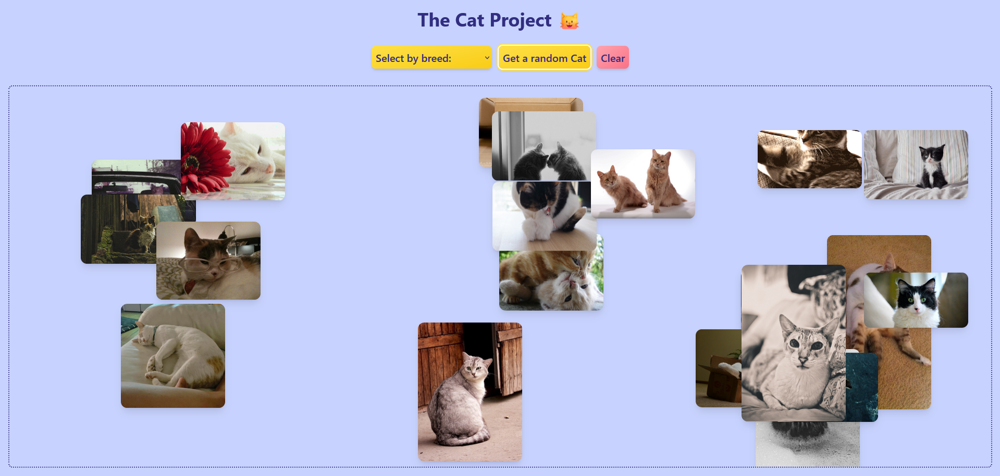

<h1 align="center">🐱 The Cat Project</h1>

<p align="center">
  <a href="https://cat-project-vanilla-js.netlify.app/">
    
  </a>
  
  
  
</p>

<p align="center">
  
</p>

Because who doesn’t need more cats in their life?   

Whether you’re on a phone, tablet, or desktop, this **responsive web app** lets you fetch random cat pictures or search by breed using [TheCatAPI](https://thecatapi.com/).  

I built it to practice **JavaScript**, **Tailwind CSS**, and working with APIs — and, of course, for some daily cat therapy. 😸

## 🎯 Features

- **Random cat images** at the click of a button  
- **Search cats by breed**  
- Cats appear in **random positions** on the screen  
- **Clear button** to reset the gallery  
- **Fully responsive**, works on mobile and desktop

## ⚡ How to Run It

**1. Clone the repo**

```sh
git clone https://github.com/evi-fil/CatProject.git
```

```sh
cd cat-project
```

**2. Get your free API key**

- Sign up at [TheCatAPI](https://thecatapi.com/)
- Copy your API key

**3. Add your API key**

1. Rename `config-example.json` to `config.json`.
2. Open `config.json` in a text editor.
3. Replace `"YOUR_API_KEY_HERE"` with your own Cat API key:

```json
{
  "catApiKey": "YOUR_API_KEY_HERE",
  "catApiUrl": "https://api.thecatapi.com/v1"
}
```

**4. Run the project locally**

Because of browser security (**CORS restrictions**), the API won’t work if you just open the file directly.  
You need to run it on a **local server**. Choose one of the following:

- **Option A — Use VS Code Live Server**  
  - Install the **Live Server** extension in VS Code  
  - Right-click `index.html` → **“Open with Live Server”**

- **Option B — Use a simple local server (no VS Code required)**  
  - If you have **Python** installed:  
    ```sh
    python -m http.server
    ```
  - Or if you have **Node.js** installed:  
    ```sh
    npx serve
    ```
    > **Note for Windows PowerShell users:**  
    > If you see an error like `running scripts is disabled`, run this first:  
    > ```sh
    > Set-ExecutionPolicy -Scope Process -ExecutionPolicy Bypass
    > ```
    > Then run `npx serve` again. This is temporary and safe.  

Boom! Instant cat overload. 🎉

## 🖼️ Demo

[Cat Project](https://cat-project-vanilla-js.netlify.app/)

## 🛠️ Built with

- HTML5
- Tailwind CSS
- JavaScript
- [TheCatAPI](https://thecatapi.com/)
- [Postman](https://www.postman.com/) (for testing API requests)
- [Netlify](https://www.netlify.com/) (for deployment)

## ✨ Notes / Personal touches

This project started as a simple “let’s fetch a cat” experiment and grew into a mini playground for **API integration**, **DOM manipulation**, and **responsive web design**.  

I tested API calls using **Postman** to ensure correct responses before integrating them into the app.  
The project is deployed on **Netlify** so you can view it live without setup.  

I also learned how to manage an **API key securely** and fetch data from [TheCatAPI](https://thecatapi.com/).  

Cats are randomly positioned for fun — because static cat pictures are boring. 😸

## 🔒 License / Usage

© 2025 @evi-fil. All rights reserved.  

This project is for **portfolio and demonstration purposes only**.  
Do **not copy, reuse, or redistribute** the code without permission.  

Note: Cat images are provided by [TheCatAPI](https://thecatapi.com/), which may have separate copyright.


